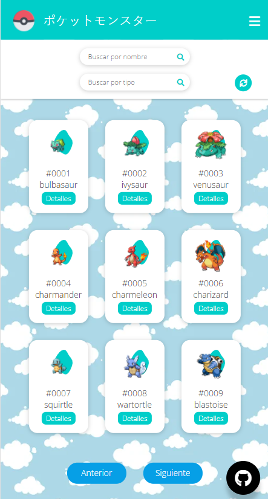

# Challenge Pokemon
## Project features 

- Mobile friendly
- No frameworks/libraries
- Use of [Pokemon API](https://pokeapi.co/)
- ES12
- ES Modules
- Languages and tools used for development : 

<code></code>
<code></code>
<code></code>
<code></code>
<code></code>

## Application functionality

- In the main view, the user will be able to see the pokemons inside cards distributed in different pages ordered by their identification number.
- Each card shows the identification number, the image and the name of the pokemon. It also has a button that shows a pop-up window with more information about the pokemon.
- For its correct operation, the user must choose between the search methods: 'search pokemon' and 'search pokemon by type'.
- The application also has a 'refresh' button which allows you to delete the search results which facilitates the user experience by reducing the interaction time.
- It has a footer section which shows my contact information.
- It has a floating button which takes you to the repository hosted on GitHub.

## End interface views

### Mobile view

### Desktop view

### Modal view

## Developer

### Pilar Rivera

 * <code></code>

  * <code></code>
  